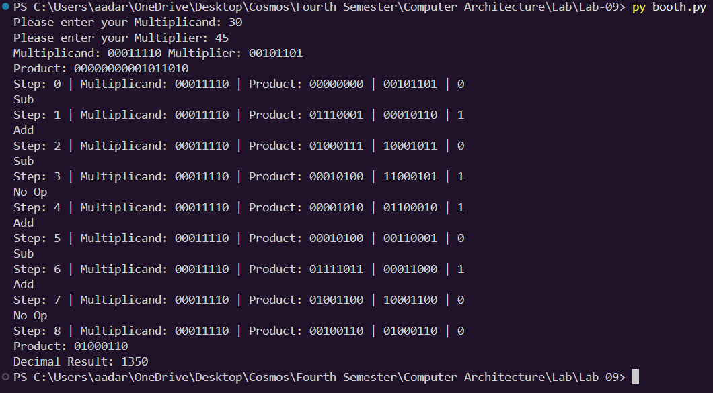

# Lab 9: Program to Implement the Booth Algorithm

## Objective
- To understand the Booth multiplication algorithm for signed binary numbers.
- To implement the Booth algorithm and verify it with test cases.

---

## Theory
The **Booth Algorithm (1951)** is an efficient method for multiplying two signed integers in two's complement representation. It reduces the number of addition/subtraction operations by exploiting runs of consecutive `1`s and `0`s in the multiplier.

---

## Algorithm
Given multiplicand $M$ and multiplier $Q$, both $n$ bits:

1. **Initialize:** 
   - Accumulator $A = 0$
   - $Q_{-1} = 0$
   - Step count = $n$

2. **Examine the last bit of $Q$ ($Q_0$) and $Q_{-1}$:**

| $Q_0$ | $Q_{-1}$ | Operation |
| :---: | :---: | :--- |
|  0  |  0  | No operation (shift only) |
|  0  |  1  | $A = A + M$ |
|  1  |  0  | $A = A - M$ |
|  1  |  1  | No operation (shift only) |

3. **Arithmetic Right Shift:**
   - Shift the combined register $[A, Q, Q_{-1}]$ by 1 bit to the right.

4. **Repeat:**
   - Repeat steps 2–3 for $n$ cycles.

5. **Result:**
   - The final result is stored in $[A, Q]$.

---
## Output

---
## Discussion and conclusion
The booths algorithm for signed integer multiplication was implemented and verified in python.
---